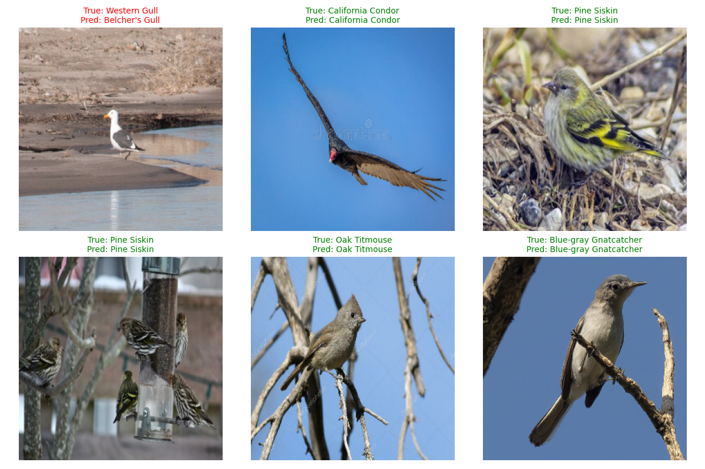

# San Diego Bird Classifier
## 530-Class Deep Learning Model for Bird Species Identification

### Overview
This project aims to classify 530 bird species native to the San Diego County area using a deep learning model based on TensorFlow and EfficientNetB0. The workflow includes:
- Web scraping bird images via SerpAPI (Google/Bing)
- Data cleaning, validation, and augmentation
- Transfer learning with class-weighted training to handle imbalance
- Model evaluation

### Motivation
Identifying bird species in the wild is a challenging task for both amateur birders and researchers. Manual identification is time-consuming, error-prone, and often requires expert knowledge. As someone who enjoys photographing and identifying birds on my hikes, I wanted to use advancements in machine learning to build a tool that would help me identify birds with more accuracy. This project aims to build a robust bird species classifier using transfer learning on the EfficientNetV2 architecture, trained on around 280,000 labeled bird images across the 530 species that can be observed in San Diego county.[^1].
This project combines my interest in birding with deep learning, with the goal of creating a tool that can assist birdwatchers, researchers, and educators in identifying birds from photos more easily and accurately.

[^1]: [San Diego County Bird Atlas](https://sdplantatlas.org/BirdAtlas/BirdPages.aspx)

### Key Features
1. Data Pipeline
- Image Scraping: Automated collection of roughly 500 images per species using SerpAPI.

- Data Validation:
  - Filter non-bird images using pretrained EfficientNetB0.
  - Convert formats to JPEG and remove corrupt files.
  - Train/Validation Split: 80/20 split with directory structuring.

2. Model Architecture
- Base Model: EfficientNetV2L pretrained on ImageNet.

- Custom Layers:
  - Data augmentation (flips, rotation, contrast, brightness).
  - Global average pooling, dense layers (1024, 512 neurons), dropout.
  - Class Weighting: Compensates for imbalanced species distribution.

3. Training
- Mixed Precision: mixed_float16 for faster training.

- Callbacks:
  - Early stopping, model checkpointing, TensorBoard logging.
  - Custom callback to save models every 5 epochs.

- Optimizer: Adam with learning rate 1e-4.

4. Evaluation
- Top-1 Accuracy: 77.16%

- Top-5 Accuracy: 91.66%

- Metrics tracked for validation performance and overfitting.

### Usage
- Link to model: https://huggingface.co/Punch-Drunk/san-diego-bird-classifier/tree/main
- Included is an app python script to set up a local website that will allow users to upload, crop, and predict images
### Dataset
- Source: Images scraped from Google/Bing using species names.

- Size: 232,389 training images | 58,331 validation images.

- Preprocessing: Resized to 256x256, normalized, augmented.

### Results

### Future Improvements
- Data Expansion: Include rare species and geographic variants.
- Model Tuning: Experiment with EfficientNetV2 or Vision Transformers.
- Deployment: Build a Flask API or mobile app for real-time classification.

### Acknowledgments
- SerpAPI for image scraping.
- TensorFlow Hub for pretrained EfficientNetB0.
- San Diego birding communities for species documentation.

For questions or contributions, reach out to ashhal.s.usmani@gmail.com!
